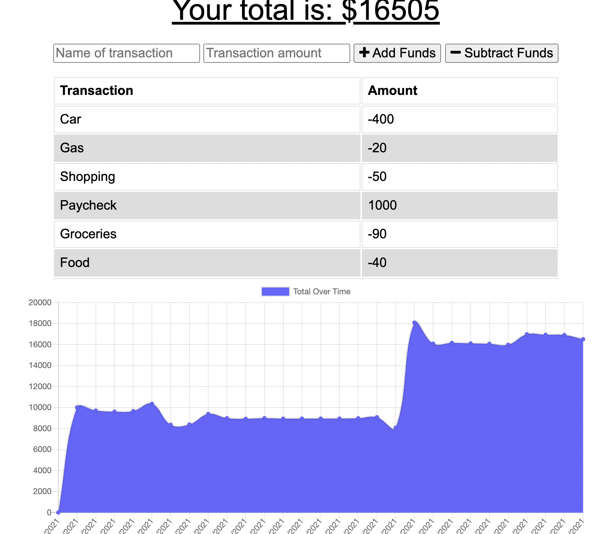

# budget-tracker

In this application a user can add transactions to a tracker that populates as a list and as a graph with dates. 
If the user is offline, they can still add transactions that will be saved as soon as they are online. 

Deployed application: https://pacific-escarpment-63710.herokuapp.com/

Github repo: https://github.com/kgentel/budget-tracker

Image of app.
